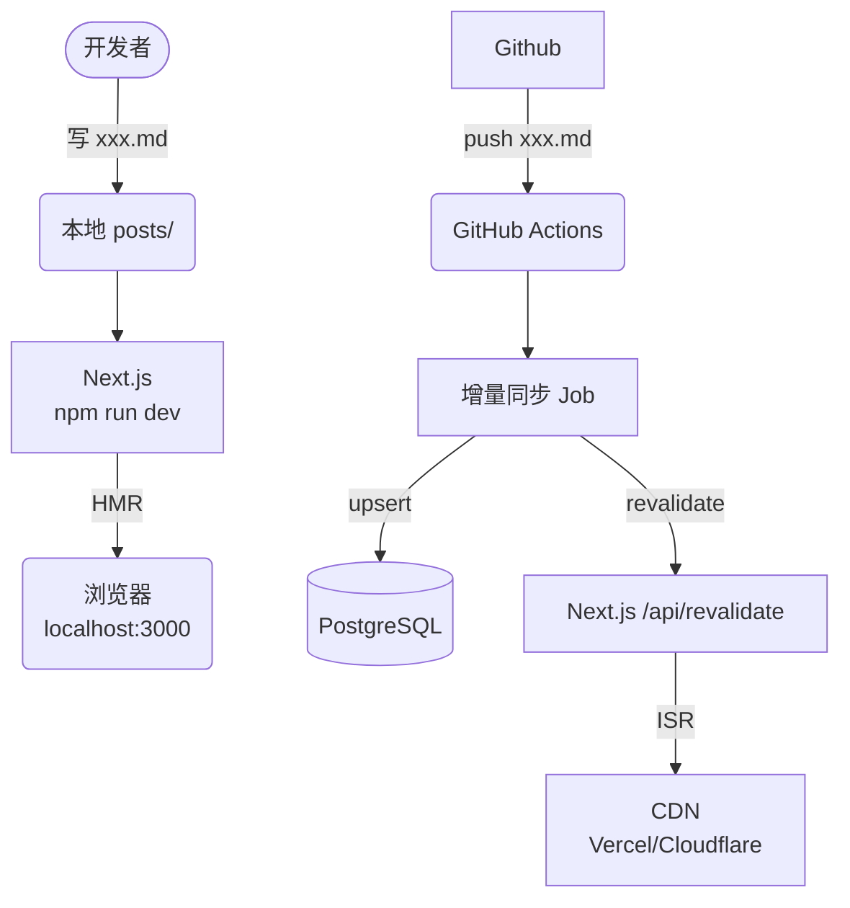
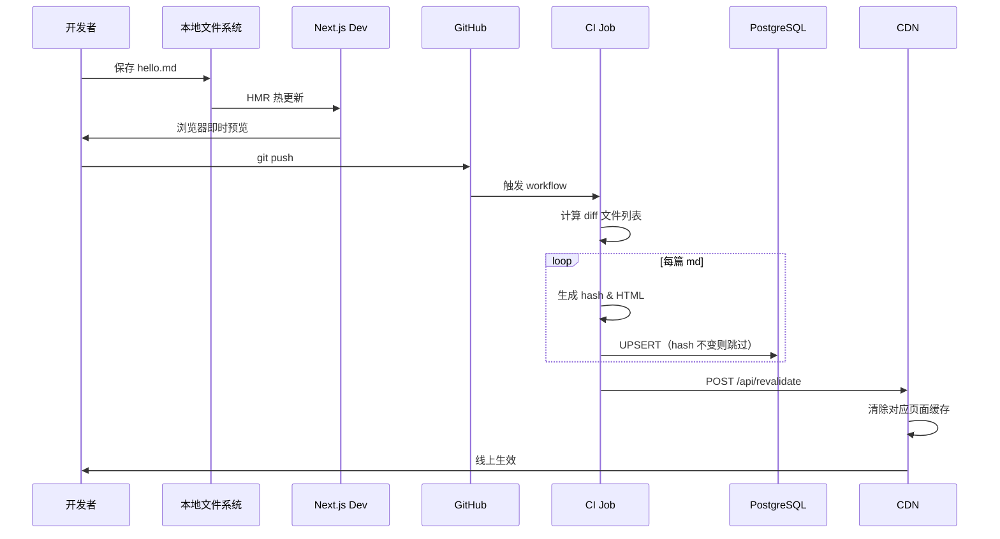

# 技术架构蓝图  
**“Next.js 主站 + Markdown 博客”**——本地秒级热更新、CI 单文件同步、生产单页 ISR

---

## 1. 总体拓扑


1

这里我们来渲染一张图片


我们再来看一个 dawroIOS

```drawio
./YQPythonServerAPIAnalysis.drawio
```

---

## 2. 角色与职责对照表
2
| 层级 | 组件 | 作用 | 性能/成本 | 备注 |
| --- | --- | --- | --- | --- |
| 源码层 | `posts/*.md` | 唯一事实源 | 体积≈KB | 可放同仓库或子模块 |
| 开发层 | Next.js `getServerSideProps` | 直接读盘渲染 | < 2 s 热更新 | 无 DB 参与 |
| 构建层 | GitHub Actions | 监听 `paths: posts/**` | 每次 ≤1 min | 仅处理 `git diff` 文件 |
| 存储层 | PostgreSQL | 存 HTML + 元数据 | 2 k 行≈几十 MB | 单表 + 哈希索引 |
| 渲染层 | Next.js ISR | `revalidate` 单页 | 首次 200 ms | 后续 CDN 缓存 |
| 分发层 | Vercel / Cloudflare | 全球 CDN | 免费档即可 | 自动 HTTPS |

---

## 3. 数据流泳道图



---

## 4. 关键算法 & 指标

| 步骤 | 算法 | 时间复杂度 | 实测耗时(2k 篇) |
| --- | --- | --- | --- |
| 扫描文件 | `glob('posts/*.md')` | O(n) | 60 ms |
| 哈希比对 | `sha256(raw)` | O(1)/file | 0.3 ms/file |
| UPSERT | `ON CONFLICT (slug) DO UPDATE …` | O(1)/row | 0.5 ms/row |
| ISR 调用 | `res.revalidate(slug)` | O(1) | 50 ms |

**全量冷启动** ≈ 9 s（仅首次 CI 跑）  
**增量热同步** ≈ 1–2 s（只改 1 篇时）

---

## 5. 本地开发快捷键

| 操作 | 命令 | 效果 |
| --- | --- | --- |
| 启动热更新 | `npm run dev` | 2 s 内浏览器刷新 |
| 单篇预览 | `code posts/xxx.md` | 保存即看 |
| 强制写库 | `npm run sync:local -- xxx.md` | 本机 DB 验证 |
| 生成静态 | `npm run build` + `npm start` | 生产 SSR 模式 |

---

## 6. 安全 & 高可用

- **CDN 边缘节点失败** → 自动回源到 Next.js SSR，无单点。  
- **DB 宕机** → Next.js `getServerSideProps` 捕获异常，降级为「磁盘只读」模式，站点仍可读。  
- **哈希索引 + 唯一约束**，保证重复推送不会脏写。  
- **CI 只读 `DATABASE_URL`**，使用 `ssl=require` 与连接池，防止泄露。

---

## 7. 一句话总结

> **「本地只盯一个 .md 文件，线上只改一行数据库，全球用户 1 秒内见到新文章」**——规模再大，写作与构建永远保持「单文件级」速度。


这段代码实现了一个**带有“展开/收起”功能的项目展示网格（Projects Grid）**。通常用于作品集（Portfolio）网站，当项目太多时，先只显示一部分（默认6个），点击按钮后显示全部。

针对你最关心的 `mounted` 及其判断条件，这是 Next.js（React 服务端渲染框架）开发中处理 **SSR（服务端渲染）与 CSR（客户端渲染）一致性** 的一种常见高级技巧。

下面我为你详细拆解其中的原理。

---


## 8.关于组件 Home 主页 showAll 到底是如何实现的
### 1. 核心功能拆解

## 8.关于组件 Home 主页 showAll 到底是如何实现的
### 1. 核心功能拆解

## 8.关于组件 Home 主页 showAll 到底是如何实现的
### 1. 核心功能拆解

## 8.关于组件 Home 主页 showAll 到底是如何实现的
### 1. 核心功能拆解

## 8.关于组件 Home 主页 showAll 到底是如何实现的
### 1. 核心功能拆解

## 8.关于组件 Home 主页 showAll 到底是如何实现的
### 1. 核心功能拆解
## 8.关于组件 Home 主页 showAll 到底是如何实现的
### 1. 核心功能拆解

## 8.关于组件 Home 主页 showAll 到底是如何实现的
### 1. 核心功能拆解

## 8.关于组件 Home 主页 showAll 到底是如何实现的
### 1. 核心功能拆解
## 8.关于组件 Home 主页 showAll 到底是如何实现的
### 1. 核心功能拆解

## 8.关于组件 Home 主页 showAll 到底是如何实现的
### 1. 核心功能拆解

## 8.关于组件 Home 主页 showAll 到底是如何实现的
### 1. 核心功能拆解
## 8.关于组件 Home 主页 showAll 到底是如何实现的
### 1. 核心功能拆解

## 8.关于组件 Home 主页 showAll 到底是如何实现的
### 1. 核心功能拆解

## 8.关于组件 Home 主页 showAll 到底是如何实现的
### 1. 核心功能拆解
## 8.关于组件 Home 主页 showAll 到底是如何实现的
### 1. 核心功能拆解

## 8.关于组件 Home 主页 showAll 到底是如何实现的
### 1. 核心功能拆解

## 8.关于组件 Home 主页 showAll 到底是如何实现的
### 1. 核心功能拆解
## 8.关于组件 Home 主页 showAll 到底是如何实现的
### 1. 核心功能拆解

## 8.关于组件 Home 主页 showAll 到底是如何实现的
### 1. 核心功能拆解

## 8.关于组件 Home 主页 showAll 到底是如何实现的
### 1. 核心功能拆解
## 8.关于组件 Home 主页 showAll 到底是如何实现的
### 1. 核心功能拆解

## 8.关于组件 Home 主页 showAll 到底是如何实现的
### 1. 核心功能拆解

## 8.关于组件 Home 主页 showAll 到底是如何实现的
### 1. 核心功能拆解
## 8.关于组件 Home 主页 showAll 到底是如何实现的
### 1. 核心功能拆解

## 8.关于组件 Home 主页 showAll 到底是如何实现的
### 1. 核心功能拆解

## 8.关于组件 Home 主页 showAll 到底是如何实现的
### 1. 核心功能拆解

## 8.关于组件 Home 主页 showAll 到底是如何实现的
### 1. 核心功能拆解

这段代码主要做了三件事：
1.  **数据截取**：
    *   设定默认显示数量 `DEFAULT_DISPLAY_COUNT = 6`。
    *   通过 `showAll` 状态控制是显示“全部数据”还是“前6条数据”。
2.  **动画封装**：
    *   使用 `<BlurFade>` 组件包裹每一个项目卡片，让卡片加载时带有模糊渐变的入场动画。
3.  **交互控制**：
    *   底部有一个“Show All”按钮，点击后将 `showAll` 设为 `true`，展示剩余项目。

---

### 2. 为什么会有 `mounted` 判断？（核心原理）

代码中使用了 `useState(false)` 初始化 `mounted`，并在 `useEffect` 中将其设为 `true`。

```javascript
const [mounted, setMounted] = useState(false);

useEffect(() => {
  setMounted(true); // 组件在客户端挂载完成后，才变为 true
}, []);
```

#### 这里的根本原因是：避免“水合不匹配” (Hydration Mismatch)

在 Next.js 中，页面渲染分为两个阶段：
1.  **服务端 (Node.js)**：生成初始的 HTML 字符串发给浏览器。
2.  **客户端 (Browser)**：React 接管页面（这一步叫 Hydration/水合），给 HTML 绑定事件。

**React 要求：** 服务端生成的 HTML 结构，必须和客户端**第一次**渲染的 HTML 结构**完全一致**。如果不一致，控制台会报 `Hydration failed` 红色错误，甚至导致页面闪烁或布局错乱。

#### 在这段代码里，不匹配点在哪里？

请看 `if (!mounted)` 和 `return` 的区别：

*   **`if (!mounted)` (服务端 + 客户端初次渲染)**：
    *   只渲染 `projects.slice(0, 6)`。
    *   **注意：这里没有渲染“Show All”按钮！**
*   **最后的 `return` (客户端二次渲染)**：
    *   渲染列表。
    *   **额外渲染了：** `{hasMore && !showAll && ( ... Button ... )}`。

#### 流程演示：

如果不加 `mounted` 判断，直接写最后的逻辑：
1.  **服务端**：不知道 `hasMore` 或交互逻辑，可能只生成了列表，或者生成了列表+按钮。但在某些特定的响应式逻辑或动态数据下，服务端很难完美预测客户端的交互状态。
2.  **客户端**：一上来就算出了 `hasMore = true`，于是渲染出“按钮”。
3.  **结果**：服务端（无按钮） vs 客户端（有按钮） -> **报错：HTML 结构不匹配。**

**加上 `mounted` 后的流程（安全模式）：**

1.  **服务端渲染**：
    *   `mounted` 初始为 `false`。
    *   执行 `if (!mounted)` 块。
    *   生成 HTML：**只有6个卡片，没有按钮。**
2.  **浏览器接收 HTML**：用户看到了6个卡片。
3.  **React 客户端水合 (Hydration)**：
    *   `mounted` 初始还是 `false`。
    *   React 渲染 `if (!mounted)` 块。
    *   生成结构：**只有6个卡片，没有按钮。**
    *   **比对结果：** 服务端 HTML === 客户端初次 HTML。**完美匹配，无报错！✅**
4.  **React 执行 `useEffect`**：
    *   `setMounted(true)` 被调用。
    *   触发重渲染 (Re-render)。
5.  **React 客户端重渲染**：
    *   `mounted` 变为 `true`，跳过 `if` 块。
    *   执行下方的 `return`。
    *   **此时才把“Show All”按钮渲染出来。**

### 3. 总结：`mounted` 的作用

这个写法是为了**延迟渲染那些只在客户端才有意义的 UI（比如那个按钮）**。

1.  **防止闪烁与报错**：确保首屏（服务端生成的）HTML 和客户端接管时的 HTML 一模一样，通过 React 的检查。
2.  **动画稳定性**：`BlurFade` 这种动画组件通常依赖浏览器的 `window` 对象或 DOM 节点位置。如果在服务端强行渲染，可能会导致样式错乱。通过 `!mounted` 确保基础结构先出来，等环境稳定了（`mounted = true`）再加载带有复杂交互或动画的完整组件。

**一句话解释**：
这个 `mounted` 判断就像一个**“安检门”**。它告诉 React：“在确保我们在浏览器里完全准备好之前，先按最简单的样子（和服务端一样）显示，等准备好了（`useEffect` 执行后），再把那个交互按钮变出来。”