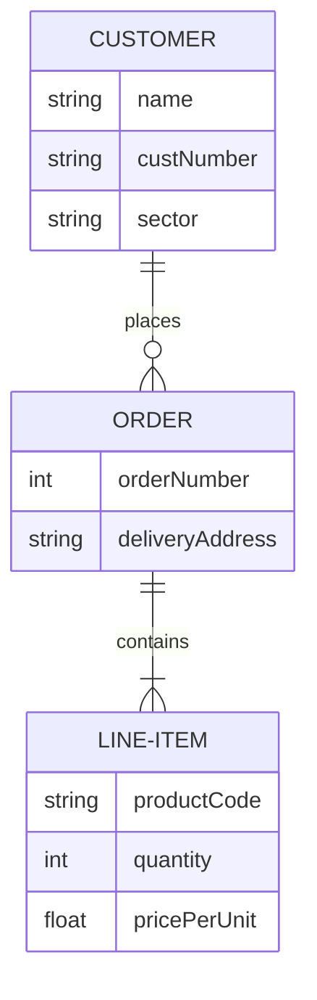

# H1
## H2 Design
### H3 
#### H4
##### H5
###### H6

A simple fix for catastrophic forgetting in VLM fine-tuning.

## Math Formula

$$
\mathcal{L} = \mathcal{L}_{task} + \lambda \cdot \|\theta - \theta_0\|^2
$$

## Architecture




## 这是一个 Draw.io 图表
```drawio
./YQPythonServerAPIAnalysis.drawio
```